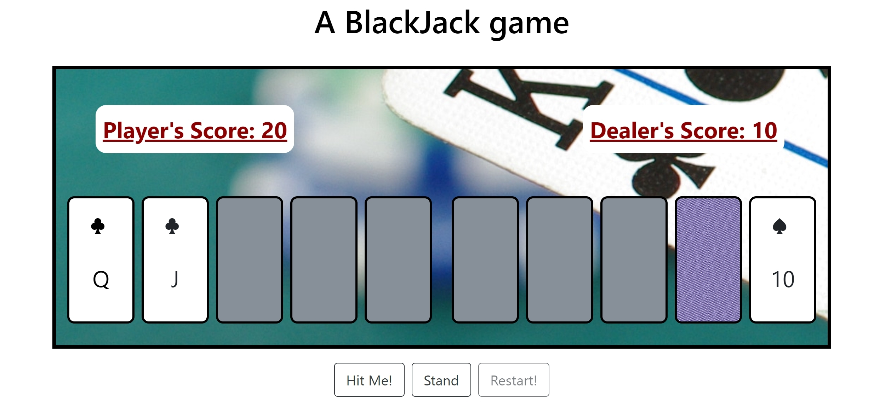

# Blackjack educational game

## 👀 Overview
Really simple project to play Blackjack. Written in HTML/CSS/JS + jQuery, it was the first project I have ever done from scratch (that's when my code lovestory started). Nothing fancy, it doesn't let you bet, but it works and the design reminds you of the Las Vegas casinos during the 90's (maybe even 80's!)

<hr/>



<hr/>

## 🔧 App Setup

None! Just ```clone``` the repo, open ```index.html``` and enjoy! 
